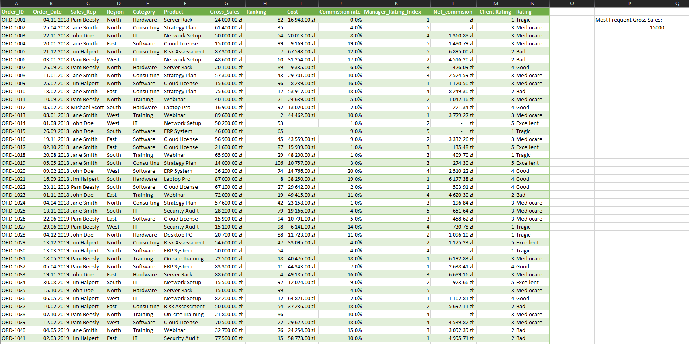
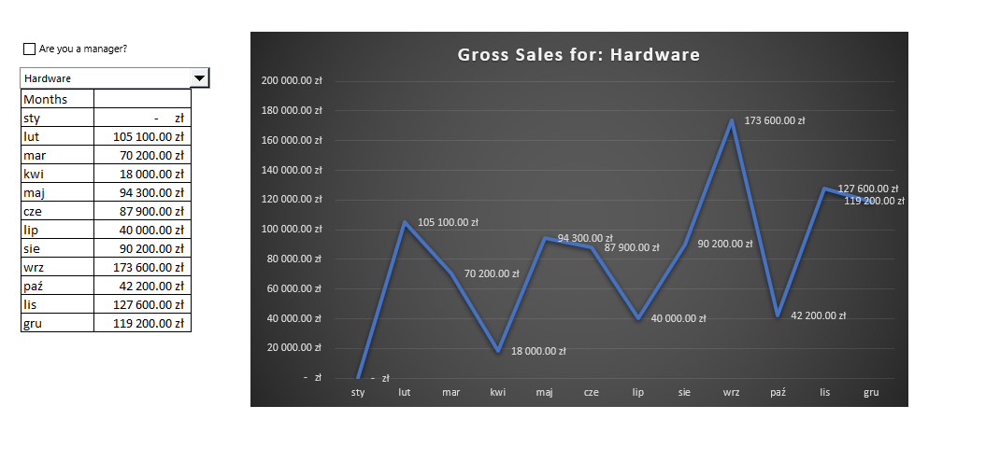
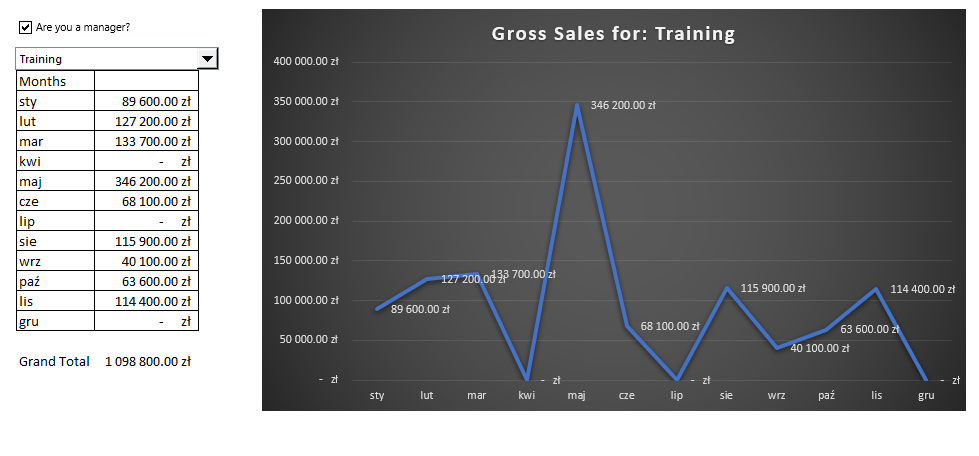
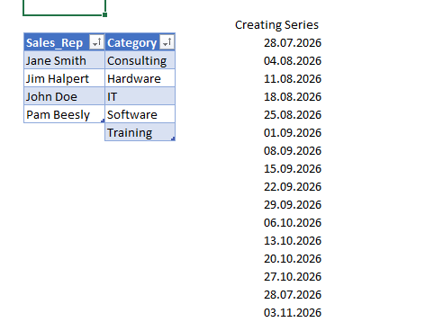
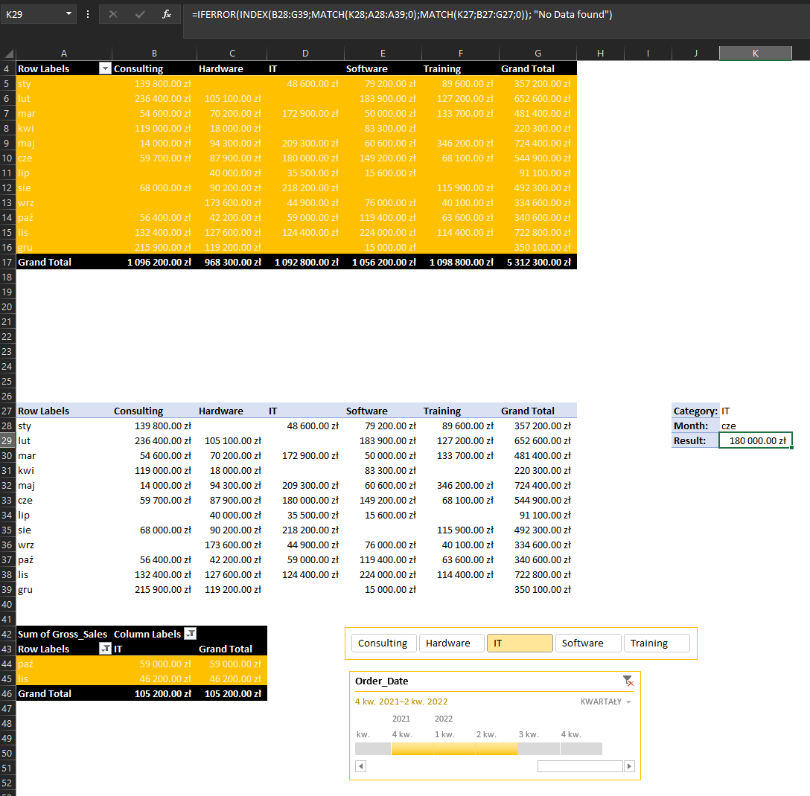
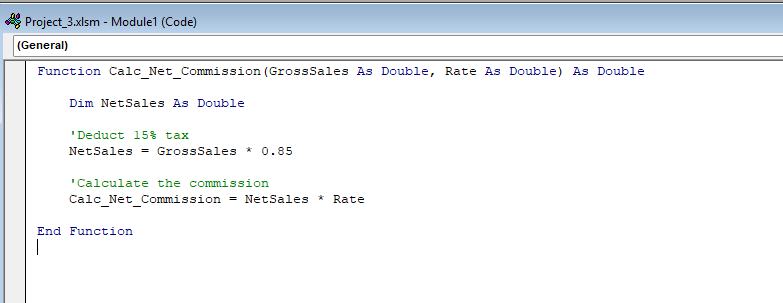
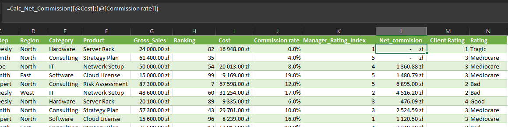

# Advanced Analytics Masterclass (Excel 2019)

## Project Overview
This project represents an expert-level application of data analytics, engineering, and dashboarding within the constrained environment of Microsoft Excel 2019 (without relying on Office 365 dynamic arrays)

The primary objective was to build a fully automated, interactive business dashboard by extracting and wrangling data from multiple external sources, writing custom logic using VBA and Array Formulas (CSE), and building a user interface with Form Controls

## Screenshots

## Core Technologies & Skills Demonstrated

### 1. Data Wrangling (Power Query)
*   **Consolidation:** Extracted and combined raw sales data from multiple separate files within a designated folder into a single structured query (`All_Sales_Data`)
*   **Web Scraping & Cleaning:** Imported external web data (e.g., currency rates/stock indices) and transformed it using the Power Query Editor (modifying data types, removing duplicates, and filtering out null values)

### 2. Advanced Lookups & Logic (Bypassing O365 Limitations)
*   **Two-Way Lookups:** Engineered complex `INDEX` and nested `MATCH` functions to dynamically extract sales data based on user-defined categorical and chronological parameters
*   **Advanced Filtering:** Replicated modern array filtering using Excel's Advanced Filter tool with complex `AND/OR` boolean logic (e.g., `Sales > 50000 OR Category = "T"`)
*   **CSE Array Formulas:** Utilized `Ctrl+Shift+Enter` (CSE) array formulas like `MODE.MULT` to calculate statistical modes and handle multiple tying values

### 3. Abstraction & Automation (VBA & Name Manager)
*   **User Defined Functions (UDF):** Compensated for the lack of `LAMBDA` by opening the VBA Editor and programming custom functions like `Calc_Net_Commission(GrossSales, Rate)` to abstract complex tax and commission logic
*   **Name Manager:** Replaced volatile range references with strictly defined Named Ranges to improve formula readability and calculation speed

### 4. Interactive Dashboarding
*   **Form Controls:** Integrated Developer Form Controls (Combo Boxes, Check Boxes, Option Buttons) directly into the spreadsheet to allow users to interact with the data without touching the underlying formulas
*   **Dynamic Data Retrieval:** Linked Form Controls to `GETPIVOTDATA` algorithms and conditional formatting (e.g., toggling a Check Box to hide sensitive financial data or swap chart colors based on KPI achievement)
*   **Report Connections:** Synchronized custom-styled Pivot Tables using interconnected Slicers and Timelines for seamless cross-filtering

## How to Explore
1. Download the `.xlsm` file (Macros must be enabled to view the UDF logic).
2. Interact with the Form Controls and Slicers on the main Dashboard sheet.
3. Open the VBA Editor (`Alt + F11`) to inspect the custom functions.
