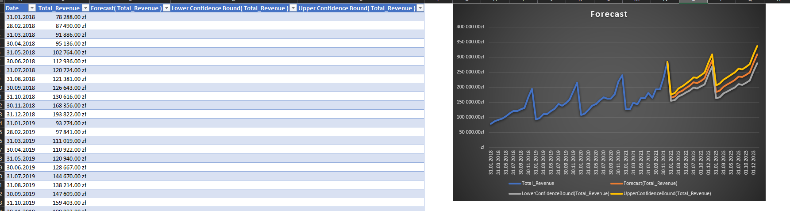
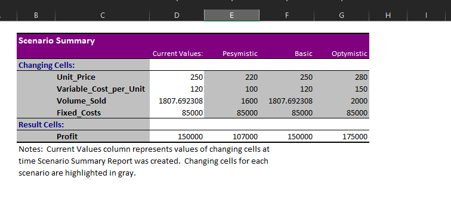
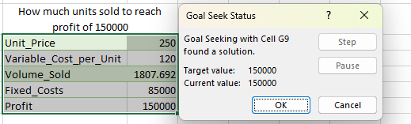

# Project 4: Business Forecasting & What-If Analysis

## Project Overview
This project focuses on predictive business analytics and financial modeling. The objective was to build a dynamic decision-support tool that models future revenue trends, evaluates business risks across multiple economic scenarios, and reverse-engineers sales targets required to hit specific profit milestones.

## Screenshots
*(Here you can see the application of the Forecast Sheet, Scenario Manager, and Goal Seek tool)*

## Core Technologies & Skills Demonstrated

### 1. What-If Analysis (Goal Seek)
*   **Target Optimization:** Utilized the Goal Seek solver to reverse-engineer mathematical formulas, specifically calculating the exact unit sales volume (`1807.69`) required to reach a hard profit target of `150,000`. 
*   **Cost-Volume-Profit (CVP) Analysis:** Built a foundational financial model linking Unit Price, Variable Costs, Fixed Costs, and Volume to dynamically calculate net outcomes.

### 2. Risk Modeling (Scenario Manager)
*   **Scenario Generation:** Developed multiple business cases (Pessimistic, Basic, Optimistic) modifying independent variables (Price, Costs, Volume) simultaneously.
*   **Summary Reporting:** Generated automated Scenario Summary reports to provide stakeholders with a clear, side-by-side comparison of how different market conditions impact the bottom-line profit.

### 3. Predictive Analytics (Time Series Forecasting)
*   **Trend Prediction:** Applied Excel's built-in Exponential Smoothing (ETS) algorithm to historical revenue data to project future sales trends.
*   **Confidence Intervals:** Calculated and visualized the Upper and Lower Confidence Bounds to account for statistical variance and seasonality in the predicted timeline.

## How to Explore
1. Download the `Project_4.xlsx` file.
2. Navigate to the **Data -> What-If Analysis** tab on the ribbon to inspect the saved Scenarios.
3. Review the generated Forecast sheet to see the historical vs. predicted data points and the corresponding chart.
