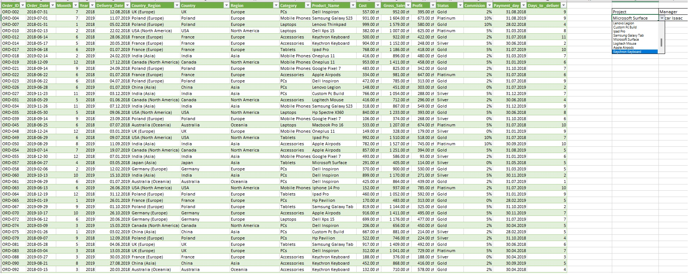
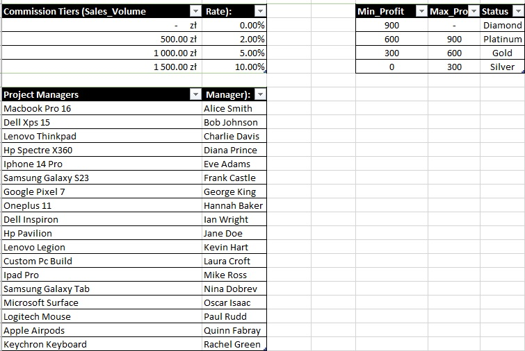
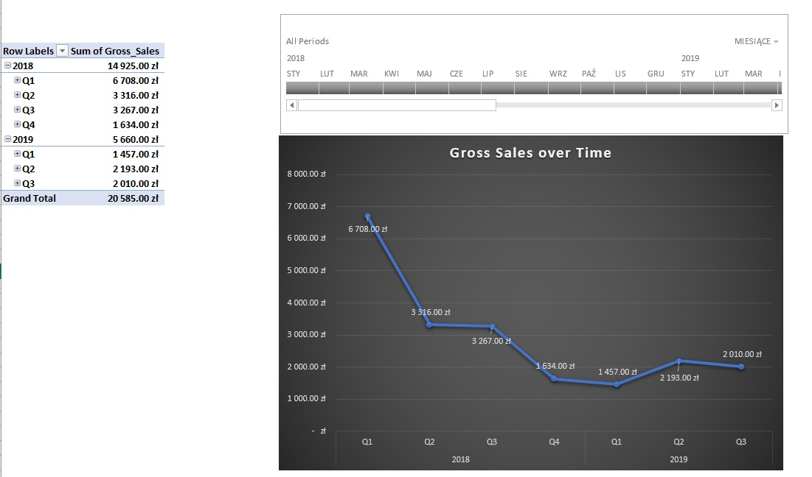
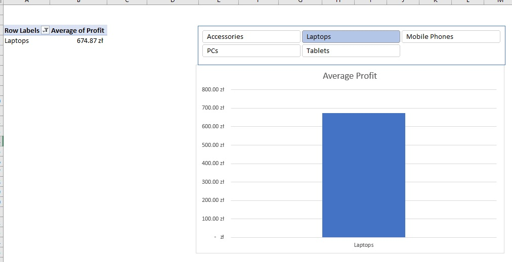

# Advanced Sales Data Analysis & Dashboard (Excel 2019)

## Project Overview
This project transforms raw, unformatted sales data into a fully interactive and responsive Excel Dashboard. The main objective was to demonstrate core data analytics skills: data cleaning, complex logical operations, advanced lookups, and dynamic visualization, strictly utilizing Excel 2019 functions (bypassing newer dynamic arrays like XLOOKUP to showcase classic analytical problem-solving).

## Screenshots

## My Implementation & Skills Demonstrated
While working with the raw dataset (`Sales_Data_Analysis.txt`), I successfully implemented the following solutions:

* **Data Cleaning:** Removed blank rows, standardized text casing using nested `PROPER(TRIM(CLEAN()))` functions, separated merged columns via Text-to-Columns, and removed duplicates to ensure data integrity.
* **Advanced Lookups:** Designed a dynamic search mechanism using the `INDEX` and `MATCH` combination (with exact match parameters) to pull Project Managers from a reference table. Implemented `VLOOKUP` with approximate match (`TRUE`) to calculate commission tiers based on sales volume.
* **Error Handling & Logic:** Wrapped critical financial calculations (Profit/Cost margins) with `IFERROR` to prevent `#DIV/0!` errors on missing cost data, preserving the overarching business dataset. Built nested `IF` statements to categorize profit margins into custom tiers (Diamond, Platinum, Gold, Silver).
* **Date Manipulation:** Calculated precise delivery timelines excluding weekends using `NETWORKDAYS` and determined invoice due dates using `EOMONTH`.
* **Interactive Dashboard:** Built Pivot Tables connected to Pivot Charts (Line and Bar charts) and integrated Report Connections with Slicers (Timeline, Region) for a fully responsive user experience.

## Disclaimer & Course Context
This project was inspired by a structured data analysis bootcamp/course. However, my execution focused exclusively on the core data wrangling, formula building, and dashboarding aspects mentioned above. 

Certain modules covered in the broader course curriculum—such as **What-If Analysis**, Goal Seek, Solver, or VBA Macros—were intentionally excluded from this specific project, as the primary goal was to solidify foundational data transformation and robust formula architecture within standard Excel constraints.
